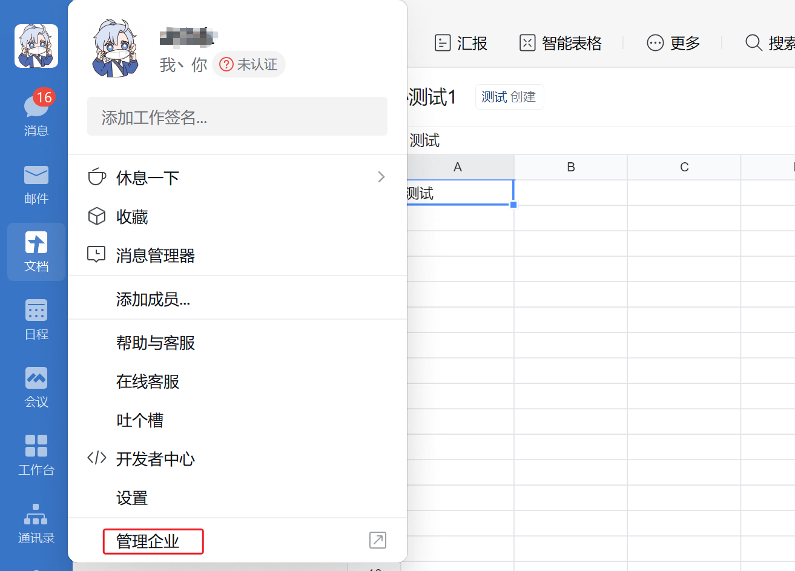
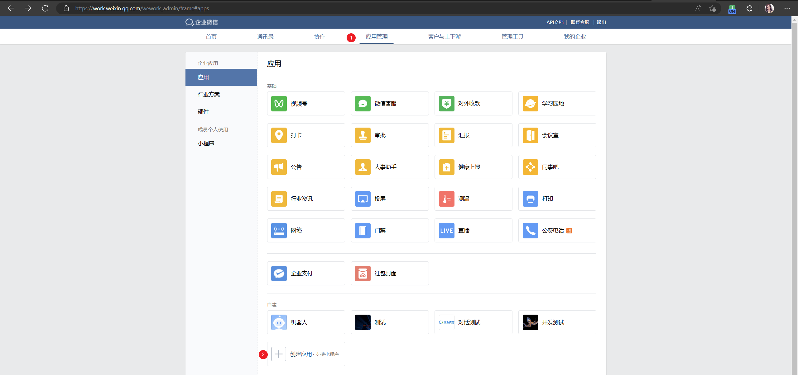
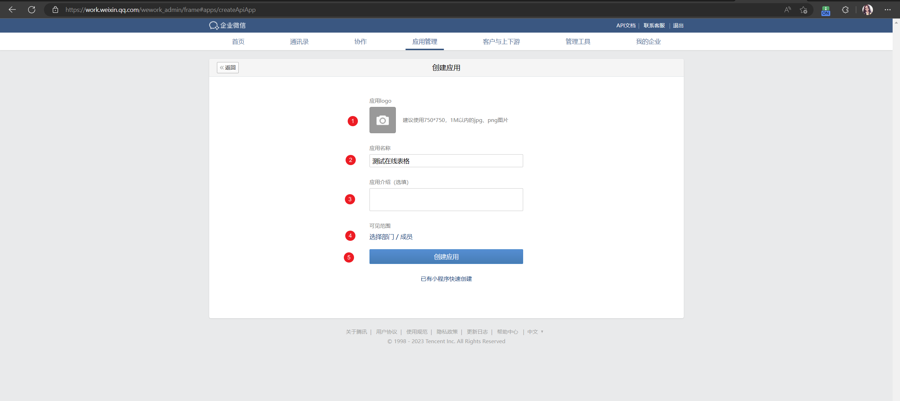
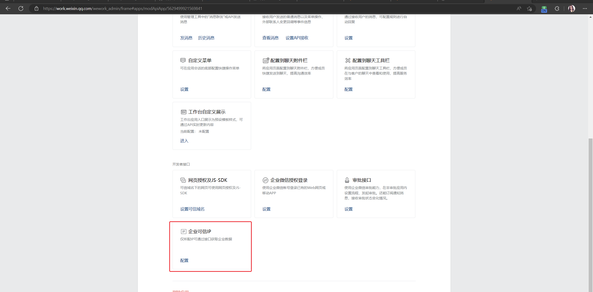
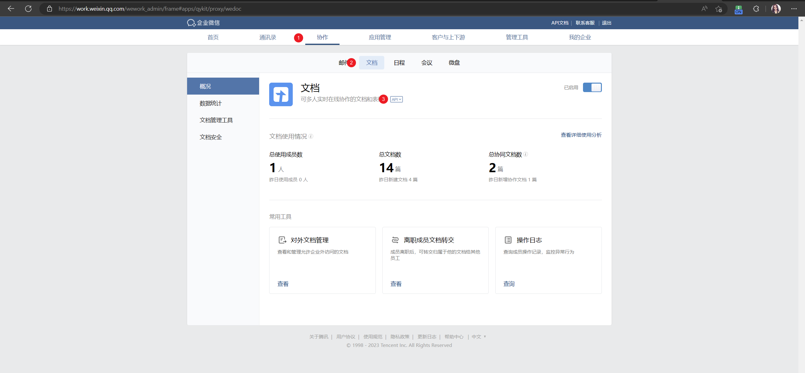
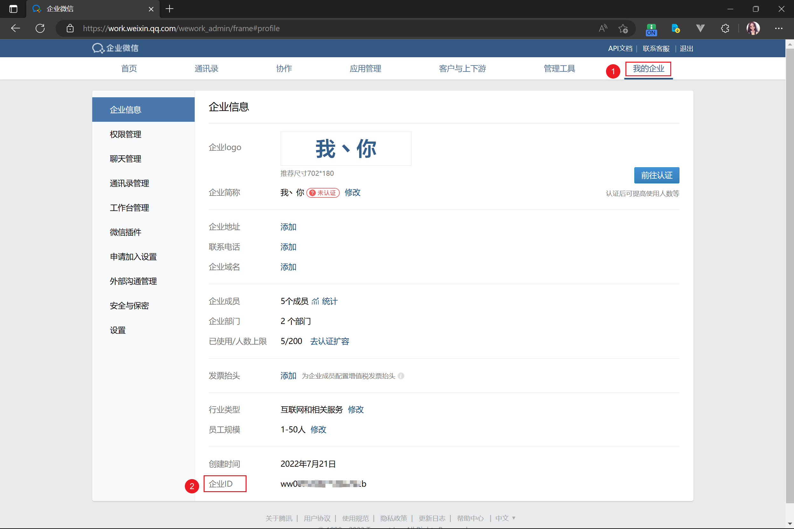
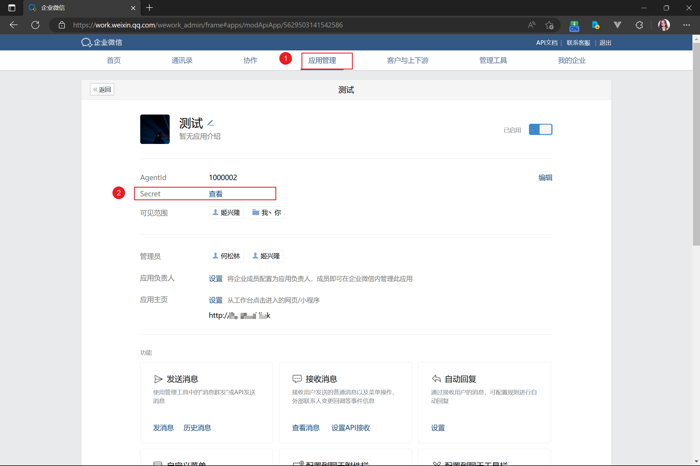
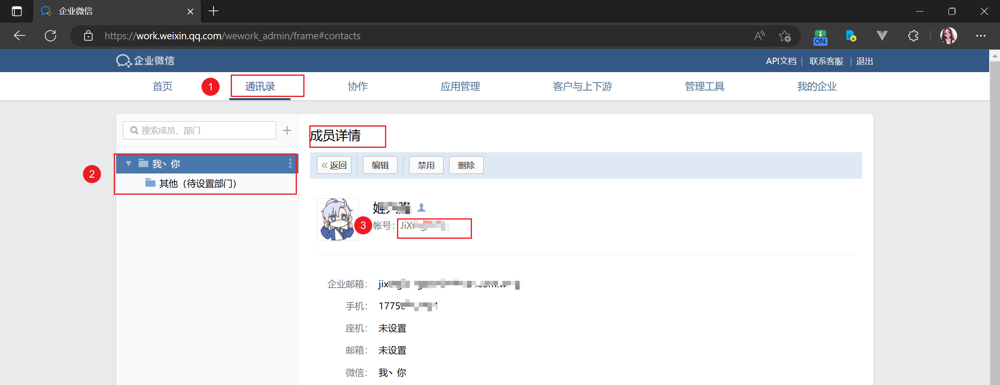

# 企业应用相关配置

## 创建企业应用


1. 从企业微信客户端进入企业微信控制台


2. 点击应用管理, 再点击创建应用


3. 配置应用基础信息


4. 配置企业可信 IP (可百度 IP 获取)


5. 在协作, 文档的 API 配置应用


6. 设置可调用接口的应用


7. 获取 `corpid`



8. 获取 `corpsecret`



## 获取文档 ID

> 目前仅支持应用创建文档

```python
corpid = "wwxxxxxxxxxxx"
corpsecret = "U8xxxxxxxxxxxxxx"


client = WedocClient(corpid, corpsecret)

# 文件类型为表格
doc_type = 4

# 文件名称

doc_name = "测试"

res = client.doc.create_doc(doc_name, doc_type, admin_users=["xxxxxxxxx"])
print(res)

```

`admin_users` 需要在控制台查看


